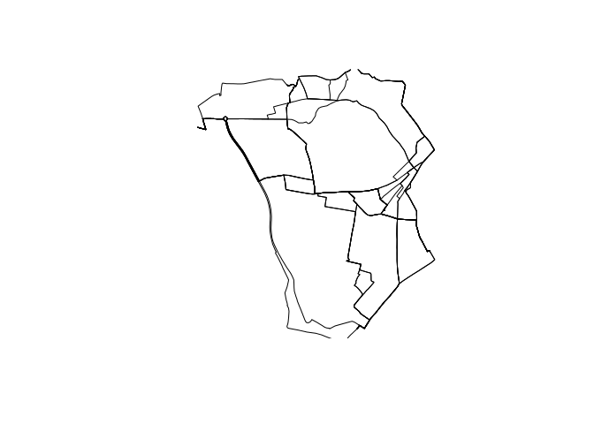

# stplanr

[](https://travis-ci.org/Robinlovelace/stplanr) [](http://cran.r-project.org/web/packages/stplanr)


```
## Loading required package: sp
```

This is a package for sustainable transport planning in R (stplanr).

It brings together a range of tools for transport planning practitioners and
researchers to better understand transport systems and inform policy.

The initial work on the project was funded by the Department of Transport
([DfT](https://www.gov.uk/government/organisations/department-for-transport))
as part of the National Propensity to Cycle Tool
([NPCT](http://www.cedar.iph.cam.ac.uk/research/modelling/npct-tool/)) project to
identify where bicycle paths are most urgently needed.

## Key functions

Square data frames representing flows between origins and destinations
must be combined with geo-referenced zones or points to generate meaningful
analyses and visualisations of flows. **stplanr** facilitates this with 
`od2line()`, which takes flow and geographical data as inputs and
outputs a `SpatialLinesDataFrame`. Some example data is provided in the package:


```r
library(stplanr)
data(cents, flow)
```

Let's take a look at this data:


```r
flow[1:3, 1:3] # typical form of flow data
```

```
##        Area.of.residence Area.of.workplace All
## 920573         E02002361         E02002361 109
## 920575         E02002361         E02002363  38
## 920578         E02002361         E02002367  10
```

```r
cents[1:3,] # points representing origins and destinations
```

```
## class       : SpatialPointsDataFrame 
## features    : 3 
## extent      : -1.546463, -1.511861, 53.8041, 53.81161  (xmin, xmax, ymin, ymax)
## coord. ref. : +init=epsg:4326 +proj=longlat +datum=WGS84 +no_defs +ellps=WGS84 +towgs84=0,0,0 
## variables   : 4
## names       :  geo_code,  MSOA11NM, percent_fem,  avslope 
## min values  : E02002382, Leeds 053,    0.408759, 2.284782 
## max values  : E02002393, Leeds 064,    0.458721, 2.856563
```

These datasets can be combined as follows:


```r
travel_network <- od2line(flow = flow, zones = cents)
w <- flow$All / max(flow$All) *10
plot(travel_network, lwd = w)
```

 

The package can also allocate flows to the travel network, for example through
a link to the [CycleStreets.net API](https://www.cyclestreets.net/api/):


```r
example("line2route")
```

  

## Installation


```r
# you must have the devtools package (e.g. via install.packages("devtools"))
devtools::install_github("robinlovelace/stplanr")
library(stplanr)
```

stplanr depends on rgdal, which can be difficult to install, especially for Mac and Linux
users.

### Install binary version of rgdal

This can be done from Ubuntu with

```
sudo apt-get install r-cran-rgdal
```

Also ggplot2, on which ggmap depends, may need to be installed as a binary, e.g.:

```
sudo apt-get install r-cran-ggplot2
```

### Set up rgdal manually

The version of gdal needs to be newer than 1.11

```r
rgdal::getGDALVersionInfo()
```

```
## [1] "GDAL 1.11.2, released 2015/02/10"
```

```r
# Should return GDAL 1.11.2, released 2015/02/10 (or newer)
```

It is possible to use the following Personal Package Archive (PPA) to get the latest version of gdal


```bash
sudo add-apt-repository ppa:ubuntugis/ubuntugis-unstable && sudo apt-get update
sudo apt-get install gdal-bin libgdal-dev
```

## Getting help

We aim to make this package well-documented to make it easy to use.
R's internal help functions will help here:


```r
trip <- route_cyclestreet(from = c(-1, 53), to = c(-1.1, 53), plan = "balanced")
# devtools::install_github("mtennekes/tmap", subdir = "pkg")
library(tmap)
osm_tiles <- read_osm(bbox(trip))
tm_shape(osm_tiles) +
  tm_raster() +
  tm_shape(trip) +
  tm_lines(lwd = 3)
```

```
## Warning in (function (x, shp_nm) : Currect projection of shape trip
## unknown. Long-lat (WGS84) is assumed.
```

 

The current list of available functions from stplanr is printed by the following
command:


```r
lsf.str("package:stplanr", all = TRUE)
```

```
## age_recat : function (a)  
## age_recat2 : function (a)  
## bbox_scale : function (bb, scale_factor)  
## calc_catchment : function (polygonlayer, targetlayer, calccols, distance = 500, projection = "+proj=aea +lat_1=90 +lat_2=-18.416667 +lat_0=0 +lon_0=10 +x_0=0 +y_0=0 +ellps=GRS80 +towgs84=0,0,0,0,0,0,0 +units=m +no_defs", 
##     retainAreaProportion = FALSE, dissolve = FALSE)  
## calc_catchment_sum : function (polygonlayer, targetlayer, calccols, distance = 500, projection = "+proj=aea +lat_1=90 +lat_2=-18.416667 +lat_0=0 +lon_0=10 +x_0=0 +y_0=0 +ellps=GRS80 +towgs84=0,0,0,0,0,0,0 +units=m +no_defs", 
##     retainAreaProportion = FALSE, dissolve = FALSE)  
## dd_logcub : function (x, a, b1, b2, b3)  
## dd_loglin : function (x, a = 0.3, b1 = -0.2)  
## dd_logsqrt : function (x, a, b1, b2)  
## disab_recat : function (a)  
## gClip : function (shp, bb)  
## gMapshape : function (dsn, percent)  
## gOnewaygeo : function (x, attrib)  
## gOnewayid : function (x, attrib, id1 = names(x)[1], id2 = names(x)[2])  
## gOverline : function (sldf, attrib, fun = sum, na.zero = FALSE)  
## gSection : function (sl)  
## islines : function (g1, g2)  
## line2df : function (l)  
## line2route : function (ldf, ...)  
## lineLabels : function (sldf, attrib)  
## od2line : function (flow, zones)  
## read_table_builder : function (dataset, filetype = "csv", sheet = 1, removeTotal = TRUE)  
## route_cyclestreet : function (from, to, plan = "fastest", silent = FALSE)  
## route_graphhopper : function (from, to, vehicle = "bike")
```

This project is released with a [Contributor Code of Conduct](CONDUCT.md).
By participating in this project you agree to abide by its terms.

Please report issues, feature requests and questions to the
[github issue tracker](https://github.com/robinlovelace/stplanr/issues).


